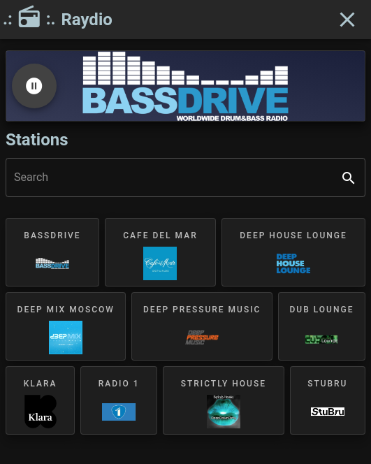

# Raydio

_A lightweight local internet radio player_ 



## Project setup
```
npm install
```

### Compiles and hot-reloads for development
```
npm run serve
```

### Compiles and minifies for production
```
npm run build
```

### Lints and fixes files
```
npm run lint
```

### Electron serve
```angular2html
npm run electron:serve
```

### Electron build app
```
npm run electron:build
```

### Adding stations

Manually update `src/assets/stations.json`

### Customize configuration
See [Configuration Reference](https://cli.vuejs.org/config/).
